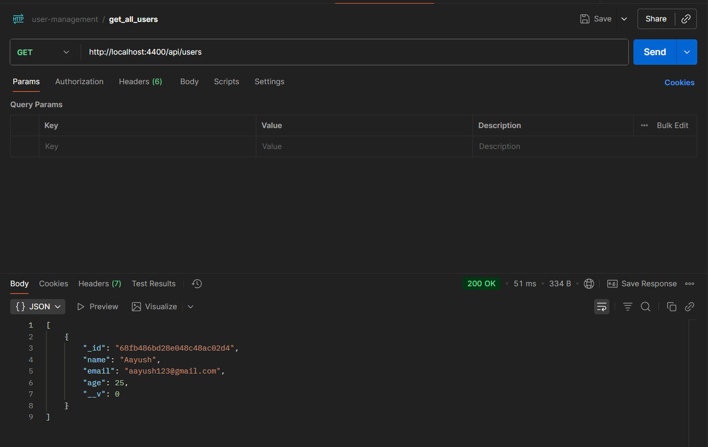

# User Management Application

This is a simple User Management API built using Node.js, Express, and MongoDB. It allows you to create, read, update, and delete users in a database.

## Description

The project demonstrates basic CRUD operations using RESTful API routes. It uses MongoDB as the database and Mongoose as the ODM. The app is easy to understand and focuses on clean and modular code structure.

## Features

- Create a new user
- Get all users
- Get a specific user by ID
- Update user details (except email)
- Delete a user
- Input validation and error handling

## Technologies Used

- Node.js
- Express.js
- MongoDB
- Mongoose
- dotenv for environment variables

## Folder Structure

- **config** — handles database connection
- **controllers** — contains route logic for CRUD operations
- **models** — defines the user schema
- **routes** — contains API route definitions
- **index.js** — main file to run the application

## API Routes

**Base URL:** `http://localhost:4040/api/users`

- **GET /** — get all users
- **GET /:id** — get a user by ID
- **POST /add** — add a new user
- **PUT /update/:id** — update user details
- **DELETE /delete/:id** — delete a user

## Screenshots

Add screenshots here to show different routes and responses.  
Example placeholders below:

- Screenshot for get all users route  
  

- Screenshot for getting current users route  
  

- Screenshot for add user route  
  

- Screenshot for update user route  
  

- Screenshot for delete user route  
  

## How to Run

1. Clone the repository
2. Run `npm install` to install dependencies
3. Create a `.env` file and add your MongoDB connection string as

```bash
   MONGO_URI=your_mongodb_connection_string
   PORT=your_port_number
```

4. Run `npm start` to start the server
5. The API will be available at `http://localhost:PORT`

## Conclusion

This project is a basic example of how to manage users using Express and MongoDB. It can be extended further by adding authentication, pagination, or frontend integration.
